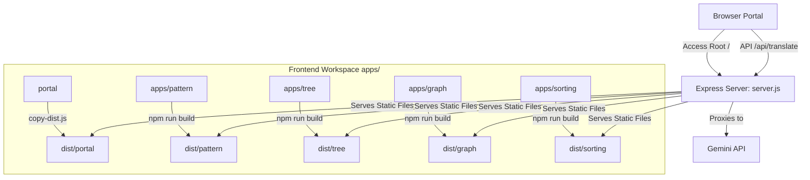

# Unified Algorithm & Data Structure Visualizer Suite: Architecture

This document details the architectural layout, directory structure, module purposes, and build integration processes for the **Unified Algorithm Visualizer Suite**.

---

## 🏗️ System Overview

The project is structured as a **monorepo-style portal** serving multiple interactive data structures and algorithm visualizers. A Node.js backend serves static files from a unified `dist/` folder and acts as an API reverse-proxy, while independent frontend client modules are compiled and copied to the `dist/` directory from the `apps/` workspace.



---

## 📁 Repository Directory Structure

Below is the directory structure highlighting key files and folder roles:

```
d:/Dsa Visualizer/
├── .env                          # Local environment secrets (e.g. GEMINI_API_KEY)
├── .gitignore                    # Prevents node_modules, .env, and dist copies from version control
├── README.md                     # General developer startup guide
├── architecture.md               # [This File] Architectural blueprint
├── copy-dist.js                  # Script copying build folders to static dist folder
├── package.json                  # Root build script and coordinator dependencies
├── server.js                     # Express API endpoint reverse-proxy & server coordinator
│
├── portal/                       # Raw static HTML gateway pages
│   ├── index.html                # Main animated Portal landing page
│   ├── stack-visualizer.html     # AI Stack Visualizer frontend layout
│   └── favicon.svg               # Portal icon
│
├── dist/                         # Unified folder served statically by server.js
│   ├── portal/                   # Copied from /portal
│   ├── pattern/                  # Copied production bundle from apps/pattern
│   ├── tree/                     # Copied production bundle from apps/tree
│   ├── graph/                    # Copied production bundle from apps/graph
│   └── sorting/                  # Copied production bundle from apps/sorting
│
└── apps/                         # Workspace containing all React applications
    ├── pattern/                  # React/TS app for string algorithms & Trie Sandbox
    │   ├── src/                  
    │   │   ├── components/       # Visualization layout panels
    │   │   ├── engines/          # Algorithmic step tracers (Naive, KMP, Rabin-Karp, Trie)
    │   │   ├── App.tsx           # Main component route controller
    │   │   └── store.ts          # Zustand global state coordinator
    │   └── package.json
    │
    ├── tree/                     # React/TS app for Tree visualizer
    │   ├── src/
    │   │   ├── components/       # Node and control layouts
    │   │   ├── engines/          # Tree operations algorithms
    │   │   ├── App.tsx           # App layout and visuals
    │   │   └── store.ts          # Zustand state for tree nodes
    │   └── package.json
    │
    ├── graph/                    # React/TS app for Graph pathfinding (BFS, DFS, Dijkstra, A*)
    │   ├── src/
    │   │   ├── components/       # Grid/Node grids and timeline controller boards
    │   │   ├── App.tsx           # Entry framework rendering the visual interfaces
    │   │   └── stores/           # State machines tracking operations & graph nodes
    │   └── package.json
    │
    └── sorting/                  # React/TS app for Sorting algorithms
        ├── src/
        │   ├── algorithms/       # Bubble, Selection, Insertion, Merge, Quick
        │   ├── components/       # Sorting array canvas and layout panels
        │   ├── App.tsx           # Entry framework rendering the visual interfaces
        │   └── stores/           # State machines tracking sorting steps
        └── package.json
```

---

## 🚪 Main Landing Page & Gateway

The landing page and gateway files are located inside the `/portal/` directory, which gets copied to `/dist/portal/`:

1. **[index.html](file:///d:/Dsa%20Visualizer/portal/index.html)**:
   * Serves as the main entrance portal.
   * Features a premium, cursor-tracking fluid backdrop mesh canvas built using modern CSS radial gradients, keyframes, and vanilla JS physics.
   * Promotes navigation cards to `/stack` (AI Stack Visualizer), `/pattern` (String Searching Suite), `/tree` (Tree Visualizer), `/sorting` (Sorting Visualizer) and `/graph` (Graph Visualizer).
2. **[stack-visualizer.html](file:///d:/Dsa%20Visualizer/portal/stack-visualizer.html)**:
   * A standalone client utility page rendering stack actions (Push, Pop, Peek).
   * Incorporates editor layouts enabling custom language code inputs to translate into trace-compatible Javascript via the backend.
3. **[server.js](file:///d:/Dsa%20Visualizer/server.js)**:
   * Listens on port `3000` (or `PORT` environment setting).
   * Serves files dynamically from the `/dist` directory.
   * Maps subdirectories cleanly to static prefixes:
     * `/` -> `dist/portal/index.html`
     * `/pattern` -> `dist/pattern`
     * `/tree` -> `dist/tree`
     * `/graph` -> `dist/graph`
     * `/sorting` -> `dist/sorting`
     * `/stack` -> `dist/portal/stack-visualizer.html`
   * Implements `/api/translate` which safely forwards user source algorithms to the **Gemini API** with instructions to return serialized visual trace operations.

---

## 🔄 Build and Distribution Pipeline (`copy-dist.js`)

To keep local development modular and compile independent SPA build assets smoothly:
1. Root `package.json` includes master `build` scripts for all workspaces:
   ```bash
   npm run build
   ```
2. This script executes `npm run build` inside all directories under `apps/` concurrently using the npm workspace feature.
3. It runs **[copy-dist.js](file:///d:/Dsa%20Visualizer/copy-dist.js)**, which:
   * Empties corresponding target folders in `dist/`.
   * Copies compiled assets (`dist/` output from Vite modules in `apps/`) directly to their respective subdirectories inside `dist/`.
   * Copies raw HTML from `portal/` to `dist/portal`.
   * Ensures the Express server can serve all sub-visualizers cleanly from their corresponding routes.
