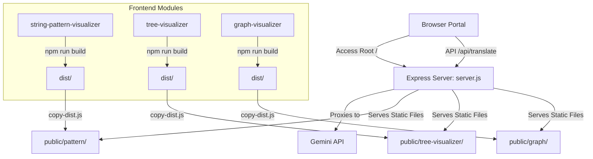

# Unified Algorithm & Data Structure Visualizer Suite: Architecture

This document details the architectural layout, directory structure, module purposes, and build integration processes for the **Unified Algorithm Visualizer Suite**.

---

## 🏗️ System Overview

The project is structured as a **monorepo-style portal** serving multiple interactive data structures and algorithm visualizers. A Node.js backend serves static files and acts as an API reverse-proxy for AI translations, while independent frontend client modules are compiled and copied to a unified static directory (`public/`).



---

## 📁 Repository Directory Structure

Below is the directory structure highlighting key files and folder roles:

```
d:/Dsa Visualizer/
├── .env                          # Local environment secrets (e.g. GEMINI_API_KEY)
├── .gitignore                    # Prevents node_modules, .env, and dist copies from version control
├── README.md                     # General developer startup guide
├── architecture.md               # [This File] Architectural blueprint
├── copy-dist.js                  # Script copying build folders to static public folder
├── package.json                  # Root build script and coordinator dependencies
├── server.js                     # Express API endpoint reverse-proxy & server coordinator
│
├── public/                       # Unified folder served statically by server.js
│   ├── favicon.svg               # Portal icon
│   ├── index.html                # Main animated Portal landing page
│   ├── stack-visualizer.html     # AI Stack Visualizer frontend layout
│   ├── pattern/                  # Copied production bundle from string-pattern-visualizer
│   ├── tree-visualizer/          # Copied production bundle from tree-visualizer
│   └── graph/                    # Copied production bundle from graph-visualizer
│
├── string-pattern-visualizer/    # React/TS/Vite app for string algorithms & Trie Sandbox
│   ├── src/
│   │   ├── components/           # Visualization layout panels
│   │   ├── engines/              # Algorithmic step tracers (Naive, KMP, Rabin-Karp, Trie)
│   │   ├── App.tsx               # Main component route controller
│   │   ├── store.ts              # Zustand global state coordinator
│   │   └── main.tsx              # React entry mount point
│   └── package.json
│
├── tree-visualizer/              # React/TS/Vite app for Tree visualizer
│   ├── src/
│   │   ├── components/           # Node and control layouts
│   │   ├── engines/              # Tree operations algorithms
│   │   ├── App.tsx               # App layout and visuals
│   │   ├── store.ts              # Zustand state for tree nodes
│   │   └── main.tsx
│   └── package.json
│
└── graph-visualizer/             # React/TS/Vite app for Graph & Sorting visualizers
    ├── src/
    │   ├── algorithms/           # Pathfinding (BFS, DFS, Dijkstra, A*) & Sorting
    │   ├── components/           # Grid/Node grids and timeline controller boards
    │   ├── App.tsx               # Entry framework rendering the visual interfaces
    │   ├── stores/               # State machines tracking operations & graph nodes
    │   └── main.tsx
    └── package.json
```

---

## 🚪 Main Landing Page & Static Assets

The landing page and gateway files are located inside the `/public/` directory:

1. **[index.html](file:///d:/Dsa%20Visualizer/public/index.html)**:
   * Serves as the main entrance portal.
   * Features a premium, cursor-tracking fluid backdrop mesh canvas built using modern CSS radial gradients, keyframes, and vanilla JS physics.
   * Promotes navigation cards to `/stack` (AI Stack Visualizer), `/pattern` (String Searching Suite), `/tree-visualizer` (Tree Visualizer), and `/graph` (Graph Visualizer).
2. **[stack-visualizer.html](file:///d:/Dsa%20Visualizer/public/stack-visualizer.html)**:
   * A standalone client utility page rendering stack actions (Push, Pop, Peek).
   * Incorporates editor layouts enabling custom language code inputs to translate into trace-compatible Javascript via the backend.
3. **[server.js](file:///d:/Dsa%20Visualizer/server.js)**:
   * Listens on port `3000` (or `PORT` environment setting).
   * Serves the `/public` path statically at the root level.
   * Maps subdirectories cleanly to static prefixes:
     * `/pattern` -> `public/pattern`
     * `/tree-visualizer` -> `public/tree-visualizer`
     * `/graph` -> `public/graph`
   * Implements `/api/translate` which safely forwards user source algorithms to the **Gemini API** with instructions to return serialized visual trace operations, keeping the API Key protected from clients.

---

## 🔄 Build and Distribution Pipeline (`copy-dist.js`)

To keep local development modular and compile independent SPA build assets smoothly:
1. Root `package.json` includes a master `build` script:
   ```bash
   npm run build
   ```
2. This script executes `npm install` and `npm run build` sequentially inside the directories `string-pattern-visualizer`, `tree-visualizer`, and `graph-visualizer`.
3. It runs **[copy-dist.js](file:///d:/Dsa%20Visualizer/copy-dist.js)**, which:
   * Empties corresponding target folders: `public/pattern`, `public/tree-visualizer`, `public/graph`.
   * Copies compiled assets (`dist/` output from Vite modules) directly to those respective folders.
   * Ensures the Express server can serve all sub-visualizers cleanly from their corresponding routes.
